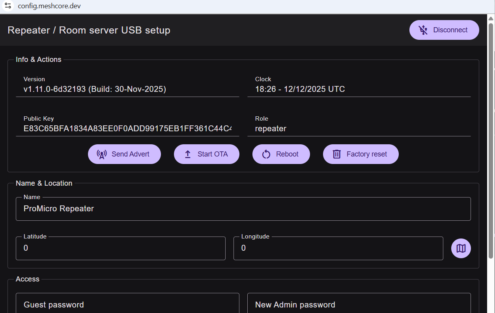
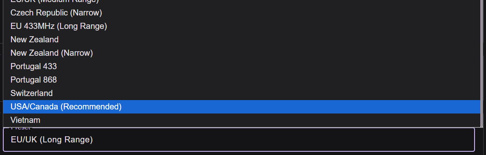
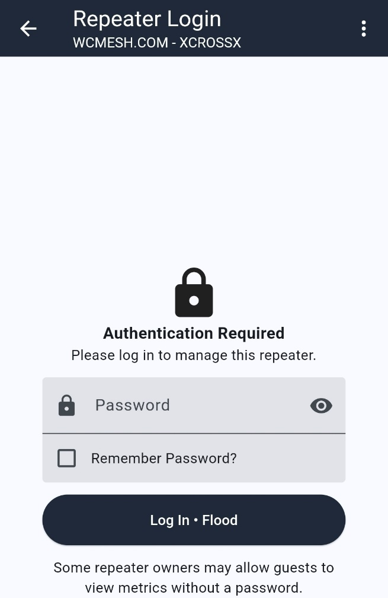

# Setting Up a Meshcore Repeater

This guide details the steps to set up your Meshcore Repeater device.

## Step 1 – Prepare the Repeater

1.  **Connect Antenna:** Verify that an antenna is connected to your unit before continuing.
2.  **Access the WebFlash App:** Go to [https://flasher.meshcore.co.uk](https://flasher.meshcore.co.uk).
3.  **Choose Role:** Choose your device from the list and select **REPEATER**.
4.  **Connect Radio:** Connect the radio via USB.
    
5.  **Enter DFU Mode:**
    * Select **ENTER DFU MODE** (labeled #1).
    * A pop-up will ask which device; select it from the menu, hit **OK**.
    
6.  **Flash the Firmware:**
    * Once in DFU mode, select **ERASE FLASH** (labeled #2).
    * Once complete, select **FLASH** (labeled #3).
    * The pop-up will appear again; select the radio again.
    

## Step 2 – First Run Configuration

1.  **Configure via USB:** After flashing is complete, click **CONFIGURE VIA USB**.
    
2.  **Connect:** Select **CONNECT** on the pop-up window.
    
3.  **Select Device:** Device Selection will pop up again; you should select your radio.
4.  **Admin Section:** Once you do so, you will be into the admin section of the radio.
    
5.  **Make Settings Match Companion:**
    * Set the **Name** and **Location** (Latitude/Longitude).
    * Set a **Guest password** (to let someone get telemetry).
    * Set a **New Admin password** (for you to login through the phone app and make changes to your repeater).
    * **Radio settings** (Preset, Frequency, Bandwidth, etc.) must match your companion.
    
    
6.  **Save and Send Advert:**
    * **SAVE** the settings.
    * Scroll back up & click **SEND ADVERT**.
    
    * The repeater should now show up in your contacts on the companion phone app.

> **Note:** The CONFIGURATION WEB APP can be used when the node is connected and any changes need to be made. It can be found here:
> 

## Step 3 – Verify Remote Management

1.  **Manage via Phone App:** Now you can manage your repeater through the phone app.
2.  **Access Repeater in App:**
    * Connect to the Meshcore app.
    * In contacts, click on the **ANTENNA TOWER** icon next to the repeater name.
    * **If the repeater doesn’t show up:** Click **TOOLS** > **DISCOVER NEARBY NODES** > **REPEATERS**, and it will find any within direct reach, you can add them in.
    
3.  **Login to Repeater Admin:**
    * Wait for the 10-second countdown (or help support the developers), click **CONTINUE**.
    * Enter the private password you created, **LOGIN**.
    
4.  **Status Page:** The Status page on loading will require the refresh. In order to minimize network usage, only what is selected to be shown is updated.
    
5.  **Send Repeater Advert via App:** To send out repeater advert, click **SETTINGS** > **ADVERT**.
    
6.  **Sync Clock (If Needed):** Some units may require a time-sync after restarts, to do this goto **SETTINGS** > **Sync Clock**.
    

## Step 4 – Deploy Your Repeater!

## Acknowledgments

#### The following guide was created by Ferret from West Coast Mesh and rr from the Louisiana Mesh community. Thank you to these contributors for their work on this guide ^~^
